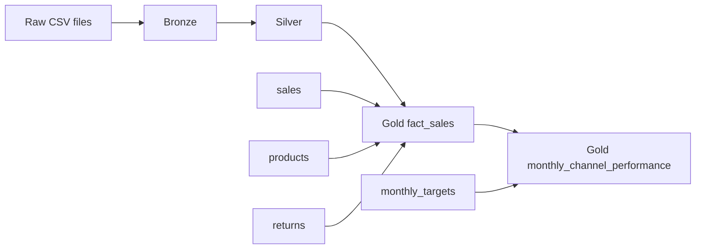

# Retail Analytics Pipeline in Databricks

A compact analytics engineering project built with Databricks, PySpark, Delta tables and a Bronze / Silver / Gold architecture.

The source data is a synthetic retail dataset with intentionally introduced data-quality issues. The pipeline ingests the raw CSV files, standardizes and validates the data, integrates multiple sources and produces business-ready sales KPIs.

## Architecture



## Data sources

- Sales
- Customers
- Products
- Returns
- Monthly targets

## Bronze layer

The raw CSV files are loaded without changing the source representation. Ingestion metadata is added and the result is stored as Delta tables.

## Silver layer

The Silver layer handles the main data-quality issues:

- mixed date formats
- inconsistent channel, region and category labels
- percentage formats such as `0.10`, `10%` and `0,10`
- invalid business values
- exact duplicates
- conflicting customer and product master records
- orphan return records
- returns where the returned quantity exceeds the sold quantity

A key principle is to distinguish technical cleaning from business validation. Valid transactions are not discarded only because related master data is incomplete.

## Gold layer

`fact_sales` keeps the transaction grain at one row per `OrderLineID` and adds:

- Gross Revenue
- Discount Amount
- Sales Net Revenue
- Net Revenue after refunds
- Net Units
- COGS
- Gross Profit

`monthly_channel_performance` aggregates the fact table by month and sales channel and adds:

- Net Revenue
- Gross Profit
- Gross Margin
- Orders
- Net Units
- Returned Orders
- Average Order Value
- Return Rate
- Revenue Target Attainment
- Gross Margin Variance

Gross Margin is calculated as total Gross Profit divided by the corresponding Net Revenue, rather than as an unweighted average of row-level margins.

## Technology

- Databricks
- PySpark
- Spark SQL
- Delta Lake
- Unity Catalog

## Repository

```text
notebooks/
  01_bronze_ingestion.py
  02_silver_cleaning.py
  03_gold_analytics.py
README.md
```
## Example Outputs

### Gold Fact Sales

The Gold fact table integrates cleaned sales, product and return data at the order-line level and contains the calculated business metrics used for further analysis.


### Monthly Channel Performance

The final Gold aggregation summarizes monthly performance by sales channel and combines actual KPIs with the corresponding business targets.


The notebooks are written for a Databricks workspace using the `workspace` catalog.
